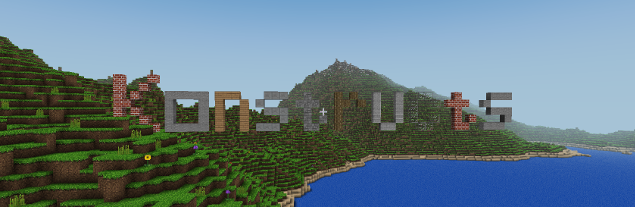

This is a Infiniminer/Minecraft inspired multiplayer open source game, focused on massive gameplay. We are trying to remove some of the limitations built into the original games.

The game is fully playable and we are running a server at play.konstructs.org. Just get the client and connect. We are incrementally update the game so what you build on the server will stay on the server.

# Play now

We have builds for Windows, Linux and the game compiles on OS X.
[Download](download)

